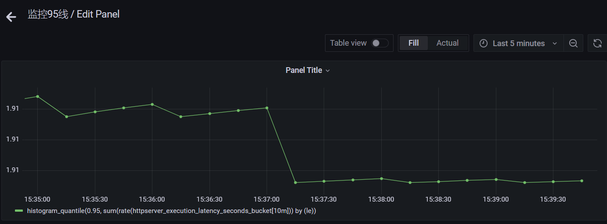
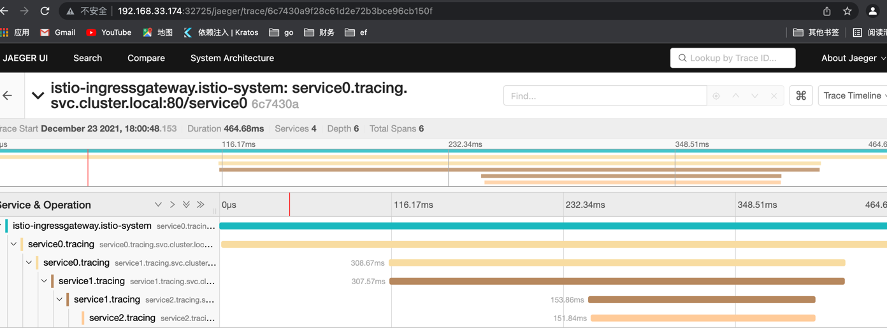

# **HOW TO USE**

## 构建本地镜像
```
git clone https://github.com/wwwhaoxu/httpserver.git
make release
```
## 通过 Docker 命令本地启动 httpserver.
```
$ docker run -it --rm -p8000:8000 -d registry.cn-beijing.aliyuncs.com/doc01/httpserver:v1.0
$ 8ed89f5cb41ee5067becb341c497a7d00543ed3c06a8546e888a8cd8d2b0d6b7
```

```
curl localhost:8000/ -i -H "name:haoxu"

$ HTTP/1.1 200 OK
name: haoxu
Accept: */*
User-Agent: curl/7.64.1
Date: Mon, 27 Sep 2021 01:06:31 GMT:wq
Content-Length: 0
```
```
获取pid
$ docker inspect --format "{{.State.Pid}}" 
8ed89f5cb41ee5067becb341c497a7d00543ed3c06a8546e888a8cd8d2b0d6b718393
```
```
通过 nsenter 进入容器查看 IP 配置
$ nsenter -t 18393 -n ip a
将镜像推送至 Docker 官方镜像仓库
docker push cncamp/httpserver:v1.0
```


## kubectl创建cm、pod、service、ingress
```
创建configmap
kubectl apply -f configmap.yaml
运行pod
kubectl apply -f pod.yaml
创建svc
kubectl apply -f service.yaml
创建ingress
kubectl apply -f ingress.yaml
```

## 查看Prometheus的指标



## 实现安全保证 和 七层路由
```
# Deploy httpserver
kubectl create ns securesvc
kubectl label ns securesvc istio-injection=enabled
kubectl create -f httpserver.yaml -n securesvc

# Create tls secret
openssl req -x509 -sha256 -nodes -days 365 -newkey rsa:2048 -subj '/O=henry Inc./CN=*.henry.io' -keyout henry.io.key -out henry.io.crt
kubectl create -n istio-system secret tls henry-credential --key=henry.io.key --cert=henry.io.crt

# Deploy virtualService and gateway
kubectl apply -f istio-specs.yaml -n securesvc 

# Check ingress ip
kubectl get svc/istio-ingressgateway -n istio-system
INGRESS_IP=10.107.158.58  #10.107.158.58为svc的CLUSTER-IP

# Access the httpserver via ingress
curl --resolve httpsserver.henry.io:443:$INGRESS_IP https://httpsserver.cncamp.io/healthz -v -k
```


## open tracing 的接入
```
具体实现见代码，改进通过引入环境变量来区分不同的服务

# Check tracing dashboard
  修改tracing service类型为NodePort

```
