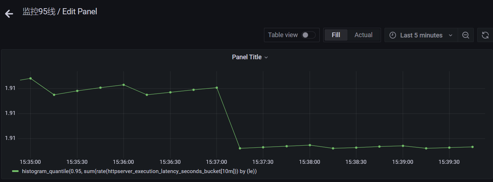

# **HOW TO USE**

## 构建本地镜像
```
git clone https://github.com/wwwhaoxu/httpserver.git
make release
```
## 通过 Docker 命令本地启动 httpserver.
```
$ docker run -it --rm -p8000:8000 -d registry.cn-beijing.aliyuncs.com/doc01/httpserver:v1.0
$ 8ed89f5cb41ee5067becb341c497a7d00543ed3c06a8546e888a8cd8d2b0d6b7
```

```
curl localhost:8000/ -i -H "name:haoxu"

$ HTTP/1.1 200 OK
name: haoxu
Accept: */*
User-Agent: curl/7.64.1
Date: Mon, 27 Sep 2021 01:06:31 GMT:wq
Content-Length: 0
```
```
获取pid
$ docker inspect --format "{{.State.Pid}}" 
8ed89f5cb41ee5067becb341c497a7d00543ed3c06a8546e888a8cd8d2b0d6b718393
```
```
通过 nsenter 进入容器查看 IP 配置
$ nsenter -t 18393 -n ip a
将镜像推送至 Docker 官方镜像仓库
docker push cncamp/httpserver:v1.0
```


## kubectl创建cm、pod、service、ingress
```
创建configmap
kubectl apply -f configmap.yaml
运行pod
kubectl apply -f pod.yaml
创建svc
kubectl apply -f service.yaml
创建ingress
kubectl apply -f ingress.yaml
```

## 查看Prometheus的指标




